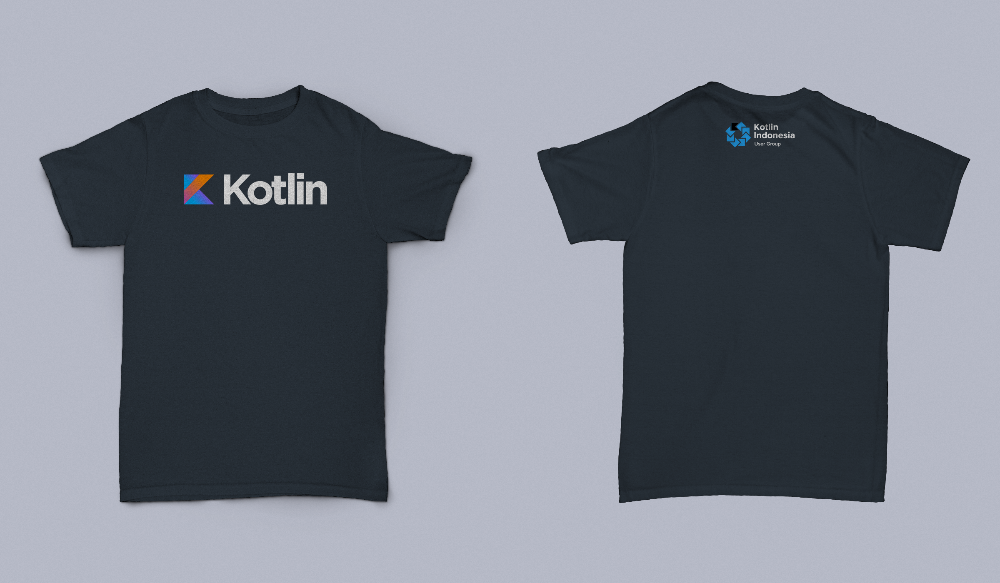
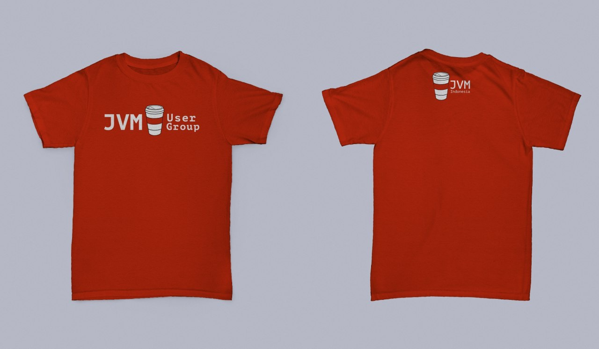

# kaos
[Daftar Order T-shirt Kotlin dan JVM User Group](http://bit.ly/kaosjvm)

Ini adalah repo untuk order t-shirt [Kotlin](t.me/@KotlinID) dan [JVM User Group](t.me/JVMUserGroup). Sengaja saya buat repo seperti ini supaya lebih praktis pakai Git ini... hahaha...

Ini design kaos yang untuk umum. Bisa dipakai masing-masing atau bersama kawan-kawan yang sealiran atau yang ingin tahu apa itu JVM User Group atau Kotlin ... Siapa yang faham dan berminat untuk beli t-shirt ini, silahkan pre-order sekarang. Limited Edition. Tidak ada jualan lagi. Wkwkwkwwk.

Harga 150K aja cukup ah. T-shirt bahan dan kualitas super dengan sablon karet sublime Premium. Ukuran dari S hingga 2XL saja.

Jangan tunggu lebih lama lagi, nanti keburu kehabisan. Order ini ditutup hari Rabu 8 November 2017. Karena T-Shirt nya akan dipakai di acara JVM Meetup 9. Jadi nanti kita pakai bajunya seragam gitu dech. Keceee badaii khann ..... Biar lebih terasa semangat JVM dan Kotlin-nya... hahahaha...

INGAT!! Order akan ditutup pada hari Rabu, 08 November 2017

Cara order dari repo ni...

1. Daftar ke link [ini.](http://bit.ly/kaosjvm)
2. Update nama sendiri dalam list file excel itu.
3. Transfer ke nomer rekening :
	
	BCA - 1393013668
	
	Mandiri - 130-001-248-5069
	
	Hendi Santika
	
	Tambah 3 digit akhir no HP.
	
	Contoh : 
	
	Saya pesan 1 Kaos Kotlin dan 3 digit no HP 881.
	Jadi, saya harus tranfer : 150881
6. Kirim bukti transaksinya ke [@hendisantika34](t.me/hendisantika34)
Dah dech Itu aje... terima kasih!

